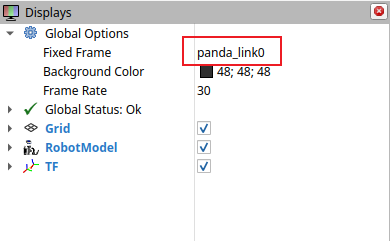
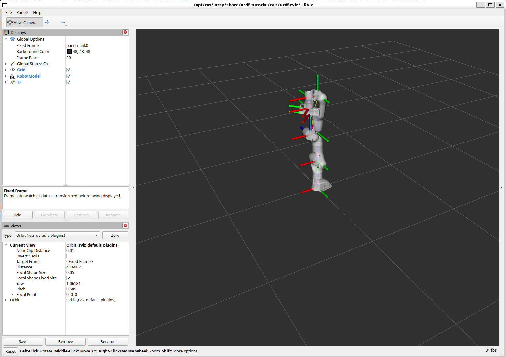

# Panda description

Most files are copied and pasted from [Moveit Resources](https://github.com/moveit/moveit_resources).

This repository adds rviz folder and launch file to visualise the panda arm.

## Learning Notes

### Change urdf and urdf.xacro paths
the default one is built from *moveit resources*, we have to replace that path to our own
```bash
cd ~/ros2_ws/src/Moveit2_Franka/panda_description

sed -i 's/moveit_resources_panda_description/panda_description/g' \
  urdf/panda.urdf urdf/panda.urdf.xacro
rg "moveit_resources|package://" urdf
```

### CMakeLists
----
In `CMakeLists.txt`, add `find_package(urdf_tutorial REQUIRED)`

and add `install` section
```txt
install (
  DIRECTORY launch meshes urdf rviz
  DESTINATION share/${PROJECT_NAME}
)
```
Notice that it's `{PROJECT_NAME}` not `(PROJECT_NAME)`, the bracket is different.

after source it, ROS2 can locate files in `DIRECTORY`

`share` store **non-executable** packages
`lib` store **executable** packages

|Directory|Purpose|
|---------|-------|
|share/${PROJECT_NAME}| 	Launch files, URDF, meshes, YAML, RViz
lib/${PROJECT_NAME} |	Compiled ROS 2 executables and nodes

### package.xml
----
add `<depend>urdf_tutorial</depend>`

### Build
----
go back to `ros2_ws` or your own workspace root name.
```bash
rosdep install --from-paths src --ignore-src -r -y
colcon build
source install/setup.bash
```

### Visualisation
----
```bash
ros2 launch urdf_tutorial display.launch.py model:=<urdf_path>
```
the default fixed frame in `urdf_tutorial` is `base_link`, remember to change it to `panda_link0`.



The final visualisation should be



### Save .rviz file
1. Click File → Save Config As.
2. Choose your package’s rviz directory, for example:
```bash
/home/kye/ros2_ws/src/Moveit2_Franka/panda_description/rviz/panda.rviz
```
run it later using the command:
```bash
ros2 launch urdf_tutorial display.launch.py \
  model:=/home/kye/ros2_ws/src/Moveit2_Franka/panda_description/urdf/panda.urdf.xacro \
  rvizconfig:=/home/kye/ros2_ws/src/Moveit2_Franka/panda_description/rviz/panda.rviz
```

### Create Launch file
----
create a Python launch file under `launch\` folder. One small thing need to notice is that:
```Python
robot_description = {
        'robot_description': Command([
            FindExecutable(name='xacro'),
            ' ',
            urdf_file
        ])
    }

```
we intend to do: `xacro /home/kye/ros2_ws/install/panda_description/share/panda_description/urdf/panda.urdf.xacro` so that we need to add `<space>` between them.

and run
```bash
cd ~/ros2_ws
colcon build --packages-select panda_description --symlink-install
source install/setup.bash
ros2 launch panda_description display.launch.py
```