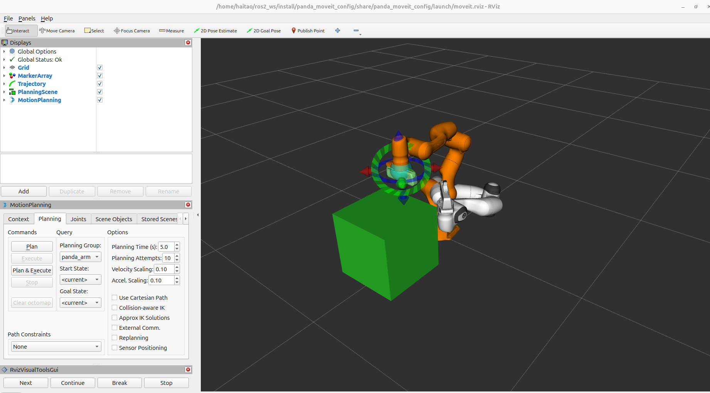

# Panda Motion Planning

After previous step that we finished all `panda_moveit_config` ROS2 package, a natural step is trying some planning and executing.
This includes
- how to write a planner file
- how to write target pose
- how to make a planning
- how to execute the successful plan

## Planning in Free Space
main reference is [Moveit Official Tutorial](https://moveit.picknik.ai/main/doc/tutorials/your_first_project/your_first_project.html).


### Planner Skeleton
```cpp
#include <memory>

#include <rclcpp/rclcpp.hpp>
#include <moveit/move_group_interface/move_group_interface.hpp>

int main(int argc, char * argv[])
{
  // Initialize ROS and create the Node
  rclcpp::init(argc, argv);
  auto const node = std::make_shared<rclcpp::Node>(
    "hello_moveit",
    rclcpp::NodeOptions().automatically_declare_parameters_from_overrides(true)
  );

  // Create a ROS logger
  auto const logger = rclcpp::get_logger("hello_moveit");

  // Next step goes here

  // Shutdown ROS
  rclcpp::shutdown();
  return 0;
}
```

Inside the planning section:
```cpp
// Create the MoveIt MoveGroup Interface
using moveit::planning_interface::MoveGroupInterface;
auto move_group_interface = MoveGroupInterface(node, "panda_arm");

// Set a target Pose
auto const target_pose = []{
  geometry_msgs::msg::Pose msg;
  msg.orientation.w = 1.0;
  msg.position.x = 0.28;
  msg.position.y = -0.2;
  msg.position.z = 0.5;
  return msg;
}();
move_group_interface.setPoseTarget(target_pose);

// Create a plan to that target pose
auto const [success, plan] = [&move_group_interface]{
  moveit::planning_interface::MoveGroupInterface::Plan msg;
  auto const ok = static_cast<bool>(move_group_interface.plan(msg));
  return std::make_pair(ok, msg);
}();

// Execute the plan
if(success) {
  move_group_interface.execute(plan);
} else {
  RCLCPP_ERROR(logger, "Planning failed!");
}
```
notice that the node should be named as `panda_arm` rather than default `manipulator` which is specified in `srdf` file.

Main tool here is `move_group_interface`.

## Plan around Box
In order to add obstacles into scene, `planning_scene_interface` is the right tool provided by `Moveit` officially.

The code structure is similar, just adding the geometry information for the obstacles we want to add.
```cpp
// Create a box obstacle
  moveit_msgs::msg::CollisionObject box;
  box.header.frame_id = move_group.getPlanningFrame();
  box.id = "box";

  shape_msgs::msg::SolidPrimitive primitive;
  primitive.type = primitive.BOX;
  primitive.dimensions = {0.4, 0.4, 0.4};

  geometry_msgs::msg::Pose box_pose;
  box_pose.orientation.w = 1.0;
  box_pose.position.x = 0.45;
  box_pose.position.y = 0.0;
  box_pose.position.z = 0.2;

  box.primitives.push_back(primitive);
  box.primitive_poses.push_back(box_pose);
  box.operation = box.ADD;

  planning_scene.applyCollisionObject(box);
```

## Run the demo
one terminal runs:
```bash
ros2 launch panda_moveit_config demo.launch.py
```

Another terminal runs:
```bash
ros2 run panda_motion_planning plan_around_box
```

